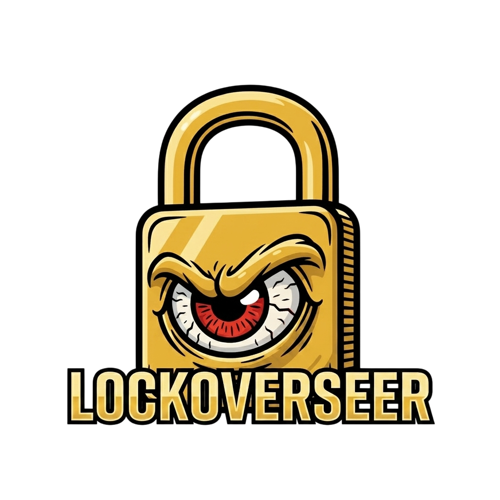
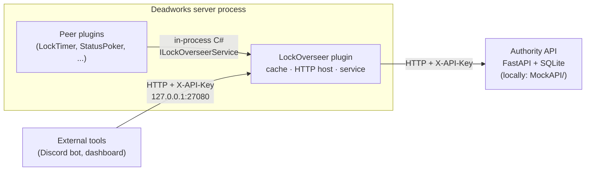
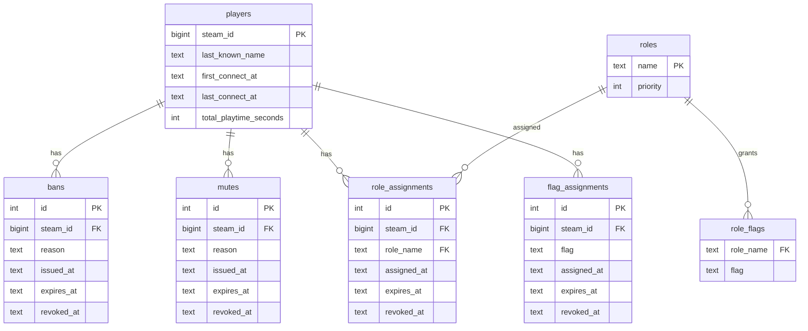
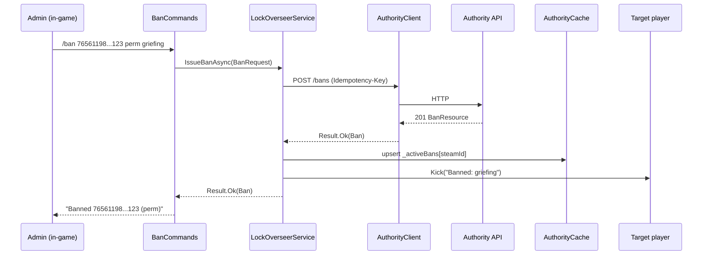

<p align="center">
  
</p>

Central player-authority plugin for [Deadlock](https://store.steampowered.com/app/1422450/Deadlock/) using the [Deadworks](https://github.com/Deadworks-net/deadworks) managed plugin system.

## What it does

LockOverseer is the first plugin installed on a Deadworks server. It owns per-player moderation state (bans, mutes, roles, flags, connect history, playtime) and exposes that state to:

- **Peer plugins** in the same process via the in-process `ILockOverseerService` C# contract.
- **External tooling** (Discord bots, admin dashboards) via a localhost-bound HTTPS-capable REST surface.

The data itself lives in an external Authority API (HTTP + SQLite). Locally that service is `MockAPI/`; in production the same contract points at your real service.

## Architecture



## Data model



## `/ban` end-to-end flow



## Quick start

```bash
# 1. Start MockAPI locally
cd MockAPI && uv sync && uv run lockoverseer-mockapi

# 2. Generate a plugin API key for your Discord bot
cd Plugins/LockOverseer/tools/LockOverseer.KeyGen
dotnet run -- add --label "discord-bot"        # prints the raw key once

# 3. Build and deploy the plugin
cd ../../src/LockOverseer
dotnet build \
  -p:DeadlockDir="/mnt/f/SteamLibrary/steamapps/common/Deadlock" \
  -p:DeadlockBin="/mnt/f/SteamLibrary/steamapps/common/Deadlock/game/bin/win64"
```

Remember to kill `deadworks.exe` before every build — the Deadworks server locks plugin DLLs.

## Configuration (`lockoverseer.json`)

```json
{
  "AuthorityApi": {
    "BaseUrl": "http://127.0.0.1:8080",
    "ApiKey": "${LOCKOVERSEER_API_KEY}",
    "TimeoutMs": 5000,
    "RetryCount": 3
  },
  "Cache": {
    "ReconcileIntervalSeconds": 300,
    "ExpirySweepSeconds": 30,
    "MaxActiveBans": 100000,
    "MaxActiveMutes": 100000
  },
  "Http": {
    "Enabled": true,
    "BindAddress": "127.0.0.1",
    "Port": 27080,
    "RequireTls": false,
    "RateLimitPerMinute": 60
  },
  "Bootstrap": { "AdminsFile": "admins.json", "SeedOnlyIfEmpty": true }
}
```

## Chat commands

| Command | Required flag | Summary |
|---|---|---|
| `/ban <player> <minutes\|perm> [reason]`    | `overseer.ban`   | Ban + kick (if connected) |
| `/unban <player> [reason]`                  | `overseer.ban`   | Revoke active ban |
| `/mute <player> <minutes\|perm> [reason]`   | `overseer.mute`  | Mute |
| `/unmute <player> [reason]`                 | `overseer.mute`  | Unmute |
| `/kick <player> [reason]`                   | `overseer.kick`  | Kick without banning |
| `/role grant <player> <role> [dur]`         | `overseer.role`  | Grant role |
| `/role revoke <player>`                     | `overseer.role`  | Revoke active role |
| `/flag grant <player> <flag> [dur]`         | `overseer.flag`  | Grant flag |
| `/flag revoke <player> <flag>`              | `overseer.flag`  | Revoke flag |
| `/whois <player>`                           | `overseer.info`  | DM full record |
| `/overseer status`                          | `overseer.admin` | Subsystem status |
| `/overseer reload`                          | `overseer.admin` | Force reconcile |
| `/overseer help`                            | —                | Command listing |

Bootstrap role defaults: `admin` → all `overseer.*`; `mod` → ban/mute/kick/info; `player` → none. `/ban`, `/unban`, `/mute`, `/unmute`, `/kick`, `/role revoke` all reject targets whose effective role has `priority >= caller.role.priority` with *"Cannot act on peer/superior"*.

## HTTP surface

Bound to `127.0.0.1:27080` by default. All requests require `X-API-Key`.

| Method | Route |
|---|---|
| `GET`    | `/v1/health` (no auth) |
| `GET`    | `/v1/players`, `/v1/players/{steam_id}` |
| `POST`   | `/v1/bans` · `GET /v1/bans` · `DELETE /v1/bans/{id}` |
| `POST`   | `/v1/mutes` · `GET /v1/mutes` · `DELETE /v1/mutes/{id}` |
| `POST`   | `/v1/players/{steam_id}/roles` · `DELETE /v1/role-assignments/{id}` |
| `POST`   | `/v1/players/{steam_id}/flags` · `DELETE /v1/flag-assignments/{id}` |
| `GET`    | `/v1/audit` |
| `GET`    | `/v1/online` · `/v1/server` · `/v1/players/{steam_id}/session` |
| `POST`   | `/v1/kick` · `/v1/chat/broadcast` |

OpenAPI docs at `/v1/docs` (toggle via `Http.DocsEnabled`). Rate limit: 60 req/min per key, 10 req/s burst on write routes. Errors use `application/problem+json`.

## Real-time events

LockOverseer subscribes to a Server-Sent Events stream from the Authority API at
`GET /events/stream` so that moderation actions (bans, mutes, role / flag grants)
issued from outside the game (e.g. a web dashboard) take effect on the live
server within ~1 second instead of waiting for the next reconciliation cycle.
When a `ban.created` event arrives for a connected player, the plugin kicks them
immediately.

### How it works

- MockAPI publishes events after each mutation in its service layer (see
  `MockAPI/src/lockoverseer_mockapi/events.py`) and streams them via
  `GET /events/stream`.
- The plugin's `AuthorityEventStream` background service holds a long-lived HTTP
  read loop, parses SSE frames, and dispatches them to cache updates, kicks,
  and hydration via `SseEventDispatcher`.
- `ReconcileService` remains the safety net: if the stream is disconnected, the
  plugin is at most `Cache.ReconcileIntervalSeconds` (default 300s) behind.

### Event catalog

| Event | Effect on the plugin |
|---|---|
| `ban.created` | Cache updated; connected player is kicked |
| `ban.revoked` | Cache cleared for that player |
| `mute.created` / `mute.revoked` | Mute cache updated |
| `role.created` / `role.updated` / `role.deleted` | Role definitions refreshed |
| `role_assignment.*` / `flag_assignment.*` | Connected player's permissions re-hydrated |
| `sync_required` | Plugin runs one full reconcile |

### Configuration

New fields under `AuthorityApi.Events` in `lockoverseer.json`:

```json
{
  "AuthorityApi": {
    "Events": {
      "Enabled": true,
      "StreamPath": "/events/stream",
      "ReconnectInitialDelayMs": 500,
      "ReconnectMaxDelayMs": 30000,
      "HeartbeatTimeoutMs": 45000
    }
  }
}
```

Set `Enabled: false` to disable the SSE subscription entirely and fall back to
poll-only behavior (the plugin will still function correctly, just with the
original ~5-minute ban-propagation latency).

### Observability

`/overseer status` shows stream health:

```
stream: connected | disconnected
last event id: <N>
```

## Build

```bash
cd Plugins/LockOverseer/src/LockOverseer
dotnet build \
  -p:DeadlockDir="/mnt/f/SteamLibrary/steamapps/common/Deadlock" \
  -p:DeadlockBin="/mnt/f/SteamLibrary/steamapps/common/Deadlock/game/bin/win64"
```

The `DeployToGame` target copies `LockOverseer.dll`, `LockOverseer.Contracts.dll`, `lockoverseer.json`, `admins.json` (if present), and `plugin_api_keys.json` to `bin/win64/managed/plugins/`.

## Peer-plugin usage

```csharp
public override void OnLoad(bool isReload)
{
    _overseer = Services.Resolve<ILockOverseerService>();
}

public override HookResult OnChatMessage(CCitadelPlayerController c, string msg)
{
    if (_overseer?.HasFlag(c.SteamId, "locktimer.can_reset_map") != true)
        return HookResult.Continue;
    // proceed
}
```

See `LockOverseer.Contracts` for the full interface — it is the only assembly peer plugins should reference.

## License

TBD.
